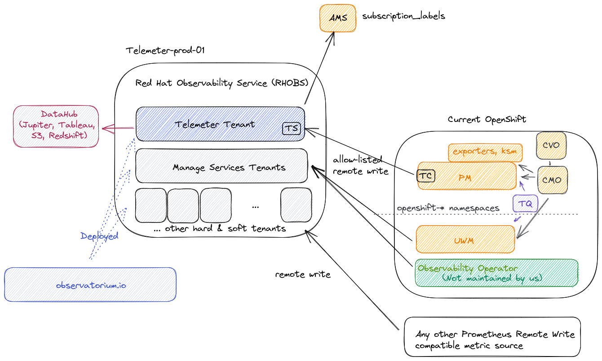

# Red Hat Observability Service

*Previous Documents:*

* [Initial Design for RHOBS (Internal Content)](https://docs.google.com/document/d/1cSz_ZbS35mk8Op92xhB9ijW1ivOtJuD1uAzPiBdSUqs/edit)
* [Initial FAQ (Internal Content)](https://docs.google.com/document/d/1_xnJBS3v7n4m229L3tqCqBXzZy55yu6dxCJY-vh_Egs/edit)

## What

Red Hat Observability Service (RHOBS) is a managed, centralized, multi-tenancy, scalable backend for the observability data. Functionally it is an [Observatorium](../observatorium.md) as A Service (SaaS) installation. RHOBS is meant to allowing ingesting, storing and using (visualisations, import, alerting, correlation) observability signals like metrics, logging and tracing is using well established APIs.

This document outlines the basic overview of the RHOBS service. If you want to learn about RHOBS architecture, look for [Observatorium](https://observatorium.io) default deployment and it's design.

### Background

With the amount of managed Openshift clusters, for Red Hat’s own use as well as for customers, there is a strong need to improve the observability of those clusters and of their workloads to the multi-cluster level. Moreover, with the “clusters as cattle” concept, more automation and complexity there is a strong need for a uniform service gathering observability data including metrics, logs, traces, etc into a remote, centralized location for multi-cluster aggregation and long term storage.

It’s worth noting that there is also a significant benefit to collecting and using multiple signals within one system:
* Correlating signals and creating a smooth and richer debugging UX.
* Sharing common functionality, like rate limiting, retries, auth, etc which allows consistent integration and management experience for users

The Openshift Monitoring Team began preparing for this shift in 2018 with the [Telemeter](telemeter.md) Service. In particular, while creating the second version of the Telemeter Service, we put effort into developing and contributing to open source systems and integration to design the [“Observatorium”](../observatorium.md): a multi-signal, multi-tenant system capable that can be operated easily and cheaply as a SaaS either by Red Hat or on-premise. After extednding scope of the RHOBS, Telemeter become the first "tenant" of the Red Hat Observability Service.

In Summer 2020, the Monitoring Team together with the Openshift Logging Team added a logging signal to the [“Observatorium”](../observatorium.md) and started to manage it for internal team as the Red Hat Observability Service.

### Status

RHOBS is managed on production already offered to various internal teams with various extensions and expansions are coming in near future.

*There is currently no plan to offer RHOBS to external customers (yet).* However anyone is welcome to deploy and manage RHOBS-like-service on their own using [Observatorium](../observatorium.md).

Usage (state as of 2021.07.01):

The metric usage is visualised in following diagram:

RHOBS is functionally separated into two main usage categories:

* Since 2018 we run Telemeter tenant for metric signal (hard tenancy). See [telemeter](telemeter.md) for details.
* Since 2021 we ingest metrics for chosen Manage Services under MST soft tenant deployment. See [MST](mst.md) for details.

Other signals:

* Since 2020 we ingest logs for DPTP team (hard tenancy).

### Owners

RHOBS was initially designed by `Monitoring Group` and its metric signal is managed and supported by `Monitoring` Group team (OpenShift organization) together with AppSRE team (Service Delivery organization).

Other signals are managed by others team (each together with AppSRE help):

* Logging signal: Openshift Logging Team
* Tracing signal: Openshift Tracing Team

Telemeter continues to be a critical service for us: it is operated jointly by AppSRE and the Observability Team (the Observability Team also performs on-call duties) and maintained on the client-side by the In-Cluster Monitoring Team.

### Support

For support see:

* [MST escalation flow](mst.md#support) and [MST SLA](mst.md#service-level-agreement).
* [Telemeter escalation flow](mst.md#support) and [Telemeter SLA](mst.md#service-level-agreement).
