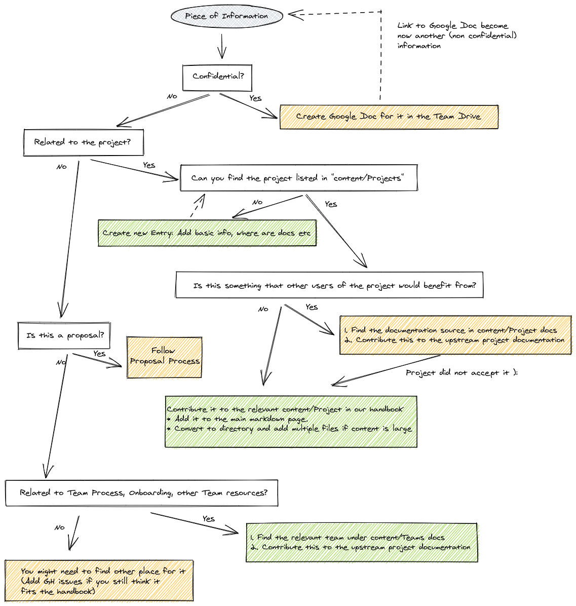

# 2021-06: Handbook

* **Owners:**:
  * [`@bwplotka`](https://github.com/bwplotka)

* **Other docs:**
  * https://works.hashicorp.com/articles/writing-practices-and-culture
  * https://about.gitlab.com/handbook/handbook-usage/#wiki-handbooks-dont-scale
  * https://gitlab.com/gitlab-com/gl-infra/infrastructure/-/issues/5143
  * [Observability Team Process (Internal)](https://docs.google.com/document/d/1eojXStPdq1hYwv36pjE-vKR1q3dlBbpIx5w_L_v2gNo/edit)
  * [Monitoring Team Processes (Internal)](https://drive.google.com/drive/folders/1yU5DYhpBLzmp3q9SIhudRMZ1rsmQ_sR2)

> TL;DR: I would like to propose to put all public documentation pieces related to the Observability Group (and not tied to a specific project) in the public GitHub repository called [`handbook`](https://github.com/rhobs/handbook). I propose to review all documents with a similar flow as code and put documents in the form of markdown files that can be read from both GitHub UI and automatically served on https://rhobs-handbook.netlify.app/ website.
>
> The [diagram](#flow-of-addingconsuming-documentation-to-handbook) below shows what fits into this handbook and what should be distributed to the relevant upstream project (e.g developer documentation).

## Why

##### Documentation is essential

* Without good team processes documentation, collaboration within the team can be challenging. Members have to figure out what to do on their own, or tribal knowledge has to be propagated. Surprises and conflicts can arise. On-boarding new team members are hard. It's vital given that our Red Hat teams are distributed over the world and working remotely.
  * Additionally, it's hard for any internal or external team to discover how to reach us or escalate without noise.
* Without a good team subject matter overview, it's hard to wrap your head around the number of projects we participate in. In addition, each team member is proficient in a different area, and we miss some "index" overview of where to navigate for various project aspects (documentation, contributing, proposals, chats).
  * Even if documentation is created, it risks being placed in the wrong place.
* Without a place for written design proposals (those in progress, those accepted and rejected), the team risks repeating iterating over the same ideas or challenging old ideas already researched.
* Without good operational or configuration knowledge, we keep asking the same question about, e.g. how to rollout service X or contribute to X etc.

##### Despite strong incentives, writing documentation was proven to be one the most unwanted task among engineers

Demotivation is because our (Google Docs based) process tends to create the following obstacles:

* There are too many side decisions to make, e.g. where to put this documentation, what format to use, how long, how to be on-topic, are we sure this information is not recorded somewhere else? Every, even small decision takes our energy and have the risk of procrastination.
* There is no review process, so it's hard to maintain a high quality of those documents.
* Created documentation is tough to consume and discover.
* Because docs are hard to discover, the documentation tends to be often duplicated, has gaps, or is obsolete.
* Documents used to be private, which brings extra demotivation. Some of the information is useful for the public audience. Some of this could be useful for external contributors. It's hard to reuse such private docs without recreating them.

All of those make people decide NOT to write documentation but rather schedule another meeting and repeat the same information repeatedly.

On a similar side, anyone looking for information about our teams' work, proposals or project is demotivated to look, find and read our documentation because it's not consistent, not in a single place, hard to discover or not completed.

### Pitfalls of the current solution

* It mainly exists in Google Docs, which has the following issues:
  * Not everything is in our Team drive.
  * Even if it's not organized well (or only clear for one person), it's not easily discoverable.
* Existing Google doc-based documents are hard to consume. The formatting is widely different. Naming is inconsistent.
* Document creation is rarely actionable. There is no review process, so the effort of creating a relevant document might be wasted, as the document is lost. This also leads to docs being in the half-completed state, demotivating readers to look at it.
* It's hard to track previous discussions around docs, who approved them (e.g. proposals).
* It's not public, and it's hard to share best practices with other external and internal teams.

## Goals

Goals and use cases for the solution as proposed in [How](#how):

* Single source of truth for Observability Group Team docs.
* Have a consistent documentation format that is readable and understandable.
* Searchable and easily discoverable.
* Process of adding documents should be easy and consistent.
* Automation and normal review process should be in place to ensure high quality (e.g. link checking).
* Allow public collaboration on processes and other docs.

### Audience

The currently planned audience for proposed documentation content is following (in importance order):

1. Observability Group Team Members (Monitoring Scrum Teams, optionally Logging and Tracing if they choose to follow our process).
2. External Teams at Red Hat.
3. Teams outside Red Hat, contributors to our projects, potential future hires, people interested in best practices, team processes etc.

## Non-Goals

* Support other formats than `Markdown` e.g. Asciidoc.
* Precise design proposal process (it will come in a separate proposal).
* Sharing Team Statuses, we use JIRA and GH issues for that.

## How

The idea is simple:

Let's make sure we maintain the process of adding/editing documentation **as easy and rewarding** as possible. This will increase the chances team members will document things more often and adopt this as a habit. Produced content will be more likely complete and up-to-date, increasing the chances it will be helpful to our audience, which will reduce the meeting burden. This will make writing docs much more rewarding, which creates a positive loop.

I propose to use git repository [`handbook`](https://github.com/rhobs/handbook) to put all related team documentation pieces there. Furthermore, I suggest reviewing all documents with a similar flow as code and placing information in the form of markdown files that can be read from both GitHub UI and automatically served on https://rhobs-handbook.netlify.app/ website.

Pros:
* Matches our [goals](#goals).
* Sharing by default.
* Low barriers to write documents in a consistent format, low barrier to consume it.
* Ensures high quality with local CI and review process.

Cons:
* Some website maintenance is needed, but we use the same and heavily automated flow in Prometheus-operator, Thanos, Observatorium websites etc.

The idea of a handbook is not new. Many organizations do this e.g [GitLab](https://about.gitlab.com/handbook/handbook-usage/#wiki-handbooks-dont-scale).

> NOTE: The website style might be not perfect (https://rhobs-handbook.netlify.app/). Feel free to propose issues, fixes to the overall look and readability!

### Flow of Adding/Consuming Documentation to Handbook

If you want to add or edit markdown documentation, refer to [our technical guide](../../contributing.md).

## Alternatives

1. Organize Team Google Drive with all Google docs we have.

Pros:
* Great for initial collaboration

Cons:
* Inconsistent format
* Hard to track approvers
* Never know when the doc is "completed."
* Hard to maintain over time
* Hard to share and reuse outside

1. Create Red Hat scoped only, a private handbook.

Pros:
* No worry if we share something internal?

Cons:
* We don't have many internal things we don't want to share at the current moment. All our projects and products are public.
* Sharing means we have to duplicate the information, copy it in multiple places.
* Harder to share with external teams
* We can't use open source tools, CIs etc.

## Action Plan

* [X] Create handbook repo and website
* [X] Create website automation (done with [mdox](https://github.com/bwplotka/mdox))
* [ ] Move existing up-to-date public documents (team processes, project overviews, faqs, design docs) over to the handbook (deadline: End of July).
  * Current Team Drive: [internal](https://drive.google.com/drive/folders/1PJHtAtxBUHxbmMx1xftrNSOJEIoYVhyO)
  * TIP: You can use [Google Chrome Plugin](https://workspace.google.com/marketplace/app/docs_to_markdown/700168918607) to convert Google Doc into markdown easily.
* [ ] Clean up Team Drive from not used or non-relevant project (or move it to some trash dir).
