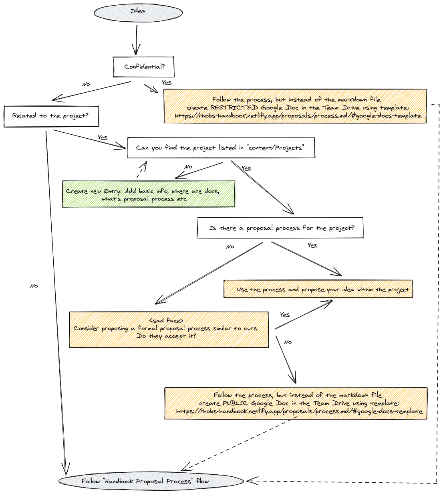
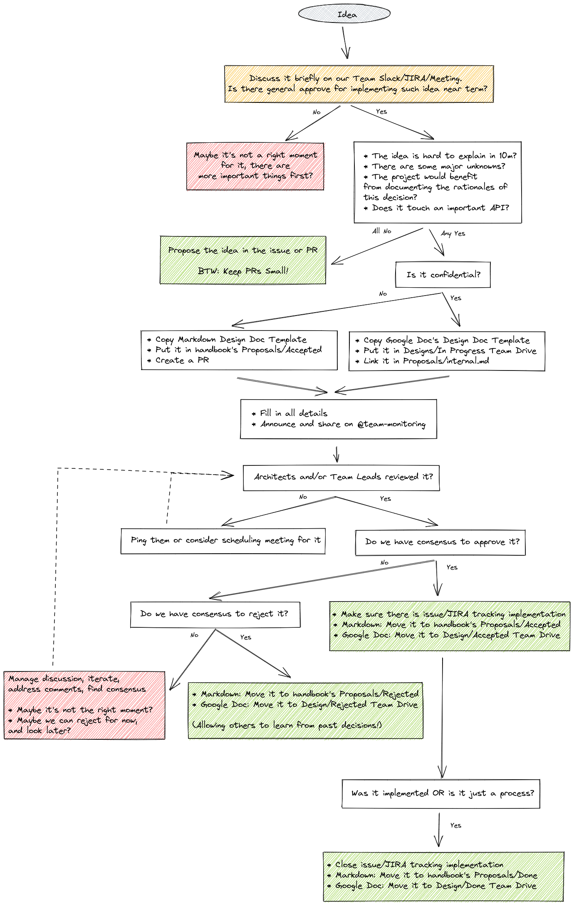

# 2021-06: Proposal Process

* **Owners:**:
  * [`@bwplotka`](https://github.com/bwplotka)

* **Other docs:**
  * [KEP Process](https://github.com/kubernetes/enhancements/blob/master/keps/README.md)
  * [Observability Team Process (Internal)](https://docs.google.com/document/d/1eojXStPdq1hYwv36pjE-vKR1q3dlBbpIx5w_L_v2gNo/edit)

> TL;DR: We would like to propose an improved, official proposal process for Monitoring Group that clearly states when, where and how to create proposal/enhancement/design documents.

## Why

More extensive architectural, process, or feature decisions are hard to explain, understand and discuss. It takes a lot of time to describe the idea, to motivate interested parties to review it, give feedback and approve. That's why it is essential to streamline the proposal process.

Given that we work in highly distributed teams and work with multiple communities, we need to allow asynchronous discussions. This means it's essential to structure the talks into shared documents. Persisting in those decisions, once approved or rejected, is equally important, allowing us to understand previous motivations.

There is a common saying [`"I've just been around long enough to know where the bodies are buried"`](https://twitter.com/AlexJonesax/status/1400103567822835714). We want to ensure the team related knowledge is accessible to everyone, every day, no matter if the team member is new or part of the team for ten years.

### Pitfalls of the current solution

Currently, the Observability Platform team have the process defined [here (internal)](https://docs.google.com/document/d/1eojXStPdq1hYwv36pjE-vKR1q3dlBbpIx5w_L_v2gNo/edit#heading=h.kpdg1wrd3pcc), whereas the In-Cluster part were not defining any official process ([as per here (internal)](https://docs.google.com/document/d/1vbDGcjMjJMTIWcua5Keajla9FzexjLKmVk7zoUc0_MI/edit#heading=h.n0ac5lllvh13)).

In practice, both teams had somehow similar flow:

* For upstream: Follow the upstream project's contributing guide, e.g Thanos
* For downstream:
  * Depending on the size:
    * Small features can be proposed during the bi-weekly team-sync or directly in Slack.
      * If the team can reach consensus in this time, then document the decision somewhere written, e.g. an email, Slack message to which everyone can add an emoji reaction, etc.
      * Add a JIRA ticket to plan this work.
    * Large features might need a design doc:
      1. Add a JIRA ticket for creating the design doc
      2. Create a new Google Doc in the team folder based on [this template](https://docs.google.com/document/d/1ddl_dLxjoIvWQuRgLdzL2Gd1EX1mkJQUZ-rgUh-T4d8/edit)
      3. Fill sections
      4. Announce it on the team mailing list and Slack channel
      5. Address comments / concerns 6 Define what "done" means for this proposal, i.e. what is the purpose of this design document:
      * Knowledge sharing / Brain dump: This kind of document may not need a thorough review or any official approval
      * Long term vision and Execution & Implementation: If approved (with LGTM comments, or in an approved section) by a majority of the team and no major concerns consider it approved. NOTE: The same applies to rejected proposals.
      1. If the document has no more offline comments and no consensus was reached, schedule a meeting with interested parties.
      2. When the document changes status, move it to the appropriate status folder in the design docs directory of the team folder. If an approved proposal concerns a component with its own directory, e.g. Telemeter, then create a shortcut to the proposal document in the component-specific directory. This helps us find design documents by topic and by status.

It served us well, but it had the following issues (really similar to ones stated in [handbook proposal](../Accepted/202106-handbook.md#pitfalls-of-the-current-solution)):

* Even if our Google Design docs organized in our team drive, those Google documents are not easily discoverable.
* Existing Google doc-based documents are hard to consume. The formatting is widely different. Naming is inconsistent.
* Document creation is rarely actionable. There is no review process, so the effort of creating a relevant document might be wasted, as the document is lost. This also leads to docs being in the half-completed state, demotivating readers to look at it.
* It's hard to track previous discussions around proposals, who approved them (e.g. proposals).
* It's not public, and it's hard to share good proposals with other external and internal teams.

## Goals

Goals and use cases for the solution as proposed in [How](#how):

* Allow easy collaboration and decision making on design ideas.
* Have a consistent design style that is readable and understandable.
* Ensure design docs are discoverable for better awareness and knowledge sharing about past decisions.
* Define a clear review and approval process.

## Non-Goals

* Define process for other documents (see [handbook proposal](../Accepted/202106-handbook.md#pitfalls-of-the-current-solution))

## How

We want to propose an improved, official proposal process for Monitoring Group that clearly states *when, where and how* to create proposal/enhancement/design documents.

Everything starts with a problem statement. It might be a missing functionality, confusing existing functionality or broken one. It might be an annoying process, performance or security issue (or potential one).

### Where to Propose Changes/Where to Submit Proposals?

As defined in [handbook proposal](../Accepted/202106-handbook.md#pitfalls-of-the-current-solution), our Handbook should tell you that Handbook is meant to be an index for our team resources and a linking point to other distributed projects we maintain or contribute to.

First, we need to identify if the idea we have is something we can contribute to an upstream project, or it does not fit anywhere else, so we can leverage the [Handbok Proposal directory](..) and the [process](#handbook-proposal-process). See the below algorithm to find it out:

[Internal Team Drive for Public and Confidential Proposals](https://drive.google.com/drive/folders/1WGqC3gMCxIQlrnjDUYfNUTPYYRI5Cxto)

[Templates](../process.md#templates)

### Handbook Proposal Process

If there is no problem, there is no need for changing anything, no need for a proposal. This might feel trivial, but we should first ask ourselves this question before even thinking about writing a proposal.

It takes time to propose an idea, find consensus and implement more significant concepts, so let's not waste time before it's worth it. But, unfortunately, even good ideas sometimes have to wait for a good moment to discuss them.

Let's assume the idea sounds interesting to you; what to do next, where to propose it? How to review it? Follow the algorithm below:

> Note: It's totally ok to reject a proposal if a team member feels the idea is wrong. It's better to explicitly oppose it than to ignore it and leave it in limbo.

> NOTE: We would love to host Logging and Tracing Teams if they choose to follow our process, but we don't want to enforce it. We are happy to extend this process from the Monitoring Group handbook to Observability Group. Still, it has to grow organically (if the Logging, Tracing team will see the value of joining us here).

### On Review Process

As you see on the above algorithm, if the content relates to any upstream project, it should be proposed, reviewed and potentially implemented together with the community. This does not mean that you cannot involve other team members towards this effort. Share the proposal with team members, even if they are not part of maintainer's team on a given project, any feedback, and voice are useful and can help to move idea further.

Similar to proposals that touch our team only, despite mentioning mandatory approval process from leads, anyone can give feedback! Our process is in fact very similar to [Hashicorp's RFC process](https://works.hashicorp.com/articles/writing-practices-and-culture):

> Once you’ve written the first draft of an RFC, share it with your team. They’re likely to have the most context on your proposal and its potential impacts, so most of your feedback will probably come at this stage. Any team member can comment on and approve an RFC, but you need explicit approval only from the appropriate team leads in order to move forward. Once the RFC is approved and shared with stakeholders, you can start implementing the solution. For major projects, also share the RFC to the company-wide email list. While most members of the mailing list will just read the email rather than the full RFC, sending it to the list gives visibility into major decisions being made across the company.

### Summary

Overall, we want to bring a culture where design docs will be reviewed in certain amount of time and authors (team members) will be given feedback. This, coupled with recognizing the work and being able to add it to your list of achievements (even if proposal was rejected), should bring more motivation for people and teams to assess ideas in structure, sustainable way.

## Alternatives

1. Organize Team Google Drive with all Google docs we have.

Pros:
* Great for initial collaboration

Cons:
* Inconsistent format
* Hard to track approvers
* Never know when the doc is "completed."
* Hard to maintain over time
* Hard to share and reuse outside

## Action Plan

* [X] Explain process in [Proposal Process Guide](../process.md)
* [ ] Move existing up-to-date public design docs over to the Handbook (deadline: End of July).
  * TIP: You can use [Google Chrome Plugin](https://workspace.google.com/marketplace/app/docs_to_markdown/700168918607) to convert Google Doc into markdown easily.
* [ ] Propose a similar process to upstream projects that do not have it.
