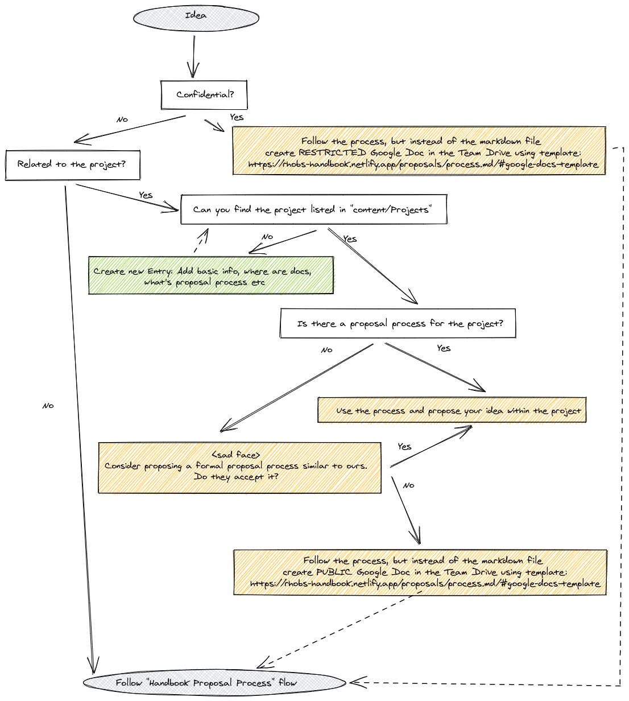

# Proposals Process

## Where to Propose Changes/Where to Submit Proposals?

As defined in [handbook proposal](Accepted/202106-handbook.md#pitfalls-of-the-current-solution), our Handbook should tell you that Handbook is meant to be an index for our team resources and a linking point to other distributed projects we maintain or contribute to.

First, we need to identify if the idea we have is something we can contribute to an upstream project, or it does not fit anywhere else, so we can leverage the [Handbok Proposal directory](..) and the [process](#proposal-process). See the below algorithm to find it out:

[Internal Team Drive for Public and Confidential Proposals](https://drive.google.com/drive/folders/1WGqC3gMCxIQlrnjDUYfNUTPYYRI5Cxto)

## Proposal Process

If there is no problem, there is no need for changing anything, no need for a proposal. This might feel trivial, but we should first ask ourselves this question before even thinking about writing a proposal.

It takes time to propose an idea, find consensus and implement more significant concepts, so let's not waste time before it's worth it. But, unfortunately, even good ideas sometimes have to wait for a good moment to discuss them.

Let's assume the idea sounds interesting to you; what to do next, where to propose it? How to review it? Follow the algorithm below:

> Note: It's totally ok to reject a proposal if a team member feels the idea is wrong. It's better to explicitly oppose it than to ignore it and leave it in limbo.

> NOTE: We would love to host Logging and Tracing Teams if they choose to follow our process, but we don't want to enforce it. We are happy to extend this process from the Monitoring Group handbook to Observability Group. Still, it has to grow organically (if the Logging, Tracing team will see the value of joining us here).

### On Review Process

As you see on the above algorithm, if the content relates to any upstream project, it should be proposed, reviewed and potentially implemented together with the community. This does not mean that you can involve other team members towards this effort. Share the proposal with team members, even if they are not part of maintainer's team on a given project, any feedback, and voice are useful and can help to move idea further.

Similar to proposals that touch our team only, despite mentioning mandatory approval process from leads, anyone can give feedback! Our process is in fact very similar to [Hashicorp's RFC process](https://works.hashicorp.com/articles/writing-practices-and-culture):

> Once you’ve written the first draft of an RFC, share it with your team. They’re likely to have the most context on your proposal and its potential impacts, so most of your feedback will probably come at this stage. Any team member can comment on and approve an RFC, but you need explicit approval only from the appropriate team leads in order to move forward. Once the RFC is approved and shared with stakeholders, you can start implementing the solution. For major projects, also share the RFC to the company-wide email list. While most members of the mailing list will just read the email rather than the full RFC, sending it to the list gives visibility into major decisions being made across the company.

## Templates

### Google Docs Template

[Open Source Design Doc Template](https://docs.google.com/document/d/1zeElxolajNyGUB8J6aDXwxngHynh4iOuEzy3ylLc72U/edit#).

### Markdown Template:

## Your Proposal Title

* **Owners:**
  * `<@author: single champion for the moment of writing>`

* **Related Tickets:**
  * `<JIRA, GH Issues>`

* **Other docs:**
  * `<Links…>`

> TL;DR: Give here a short summary of what this document is proposing and what components it is touching. Outline rough idea of proposer's view on proposed changes.
>
> *For example: This design doc is proposing a consistent design template for “example.com” organization.*

## Why

Put here a motivation behind the change proposed by this design document, give context.

*For example: It’s important to clearly explain the reasons behind certain design decisions in order to have a consensus between team members, as well as external stakeholders. Such a design document can also be used as a reference and knowledge-sharing purposes. That’s why we are proposing a consistent style of the design document that will be used for future designs.*

### Pitfalls of the current solution

What specific problems are we hitting with the current solution? Why it’s not enough?

*For example, We were missing a consistent design doc template, so each team/person was creating their own. Because of inconsistencies, those documents were harder to understand, and it was easy to miss important sections. This was causing certain engineering time to be wasted.*

## Goals

Goals and use cases for the solution as proposed in [How](#how):

* Allow easy collaboration and decision making on design ideas.
* Have a consistent design style that is readable and understandable.
* Have a design style that is concise and covers all the essential information.

### Audience

If not clear, the target audience that this change relates to.

## Non-Goals

* Move old designs to the new format.
* Not doing X,Y,Z.

## How

Explain the full overview of the proposed solution. Some guidelines:

* Make it concise and **simple**; put diagrams; be concrete, avoid using “really”, “amazing” and “great” (:
* How you will test and verify?
* How you will migrate users, without downtime. How we solve incompatibilities?
* What open questions are left? (“Known unknowns”)

## Alternatives

The section stating potential alternatives. Highlight the objections reader should have towards your proposal as they read it. Tell them why you still think you should take this path [[ref](https://twitter.com/whereistanya/status/1353853753439490049)]

1. This is why not solution Z...

## Action Plan

The tasks to do in order to migrate to the new idea.

* [ ] Task one <GH issue/JIRA ticket>
* [ ] Task two <GH issue/JIRA ticket> ...
