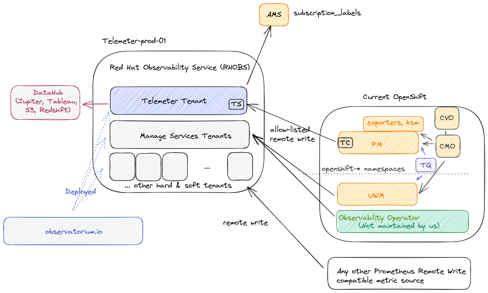

# Red Hat Observability Service

*Previous Documents:*

* [Initial Design for RHOBS (Internal Content)](https://docs.google.com/document/d/1cSz_ZbS35mk8Op92xhB9ijW1ivOtJuD1uAzPiBdSUqs/edit)
* [Initial FAQ (Internal Content)](https://docs.google.com/document/d/1_xnJBS3v7n4m229L3tqCqBXzZy55yu6dxCJY-vh_Egs/edit)

## What

Red Hat Observability Service (RHOBS) is a managed, centralized, multi-tenant, scalable backend for observability data. Functionally it is an internal deployment of [Observatorium](../../Projects/Observability/observatorium.md) project. RHOBS is designed to allow ingesting, storing and consuming (visualisations, import, alerting, correlation) observability signals like metrics, logging and tracing.

This document provides the basic overview of the RHOBS service. If you want to learn about RHOBS architecture, look for [Observatorium](https://observatorium.io) default deployment and its design.

### Background

With the amount of managed Openshift clusters, for Red Hat’s own use as well as for customers, there is a strong need to improve the observability of those clusters and of their workloads to the multi-cluster level. Moreover, with the “clusters as cattle” concept, more automation and complexity there is a strong need for a uniform service gathering observability data including metrics, logs, traces, etc into a remote, centralized location for multi-cluster aggregation and long term storage.

This need is due to many factors:

* Managing applications running on more than one cluster, which is a default nowadays (cluster as a cattle),
* Need to offload data and observability services from edge cluster to reduce complexity and cost of edge cluster (e.g remote health capabilities).
* Allow offloading teams from maintaining their own observability service.

It’s worth noting that there is also a significant benefit to collecting and using multiple signals within one system:
* Correlating signals and creating a smooth and richer debugging UX.
* Sharing common functionality, like rate limiting, retries, auth, etc, which allows a consistent integration and management experience for users.

The Openshift Monitoring Team began preparing for this shift in 2018 with the [Telemeter](use-cases/telemetry.md) Service. In particular, while creating the second version of the Telemeter Service, we put effort into developing and contributing to open source systems and integration to design [“Observatorium”](../../Projects/Observability/observatorium.md): a multi-signal, multi-tenant system that can be operated easily and cheaply as a Service either by Red Hat or on-premise. After extending the scope of the RHOBS, Telemeter become the first "tenant" of the RHOBS.

In Summer 2020, the Monitoring Team together with the OpenShift Logging Team added a logging signal to [“Observatorium”](../../Projects/Observability/observatorium.md) and started to manage it for internal teams as the RHOBS.

### Status

RHOBS is running in production and has already been offered to various internal teams, with more extensions and expansions coming in the near future.

*There is currently no plan to offer RHOBS to external customers.* However anyone is welcome to deploy and manage an RHOBS-like-service on their own using [Observatorium](../../Projects/Observability/observatorium.md).

Usage (state as of 2021.07.01):

The metric usage is visualised in the following diagram:

RHOBS is functionally separated into two main usage categories:

* Since 2018 we run Telemeter tenant for metric signal (hard tenancy, `telemeter-prod-01` cluster). See [telemeter](use-cases/telemetry.md) for details.
* Since 2021 we ingest metrics for selected Managed Services as soft tenants in an independent deployment (separate soft tenant, `telemeter-prod-01` cluster). See [MST](use-cases/observability.md) for details.

Other signals:

* Since 2020 we ingest logs for the DPTP team (hard tenancy, `telemeter-prod-01` cluster).

> Hard vs Soft tenancy: In principle hard tenancy means that in order to run system for multiple tenants you run each stack (can be still in single cluster, yet isolated through e.g namespaces) for each tenant. Soft tenancy means that we reuse same endpoint and services to handle tenant APIs. For tenant both tenancy models should be invisible. We chose Telemeter to be deployed in different stack, because of Telemeter critical nature and different functional purpose that makes Telemeter performance characteristics bit different to normal monitoring setup (more analytics-driven cardinality).

### Owners

RHOBS was initially designed by `Monitoring Group` and its metric signal is managed and supported by `Monitoring` Group team (OpenShift organization) together with AppSRE team (Service Delivery organization).

Other signals are managed by others team (each together with AppSRE help):

* Logging signal: OpenShift Logging Team
* Tracing signal: OpenShift Tracing Team

Telemeter part client side is maintained by In-cluster Monitoring team, but managed by corresponding client cluster owner.

### Support

For support see:

* [MST escalation flow](use-cases/observability.md#support) and [MST SLA](use-cases/observability.md#service-level-agreement).
* [Telemeter escalation flow](use-cases/telemetry.md#support) and [Telemeter SLA](use-cases/telemetry.md#service-level-agreement).
