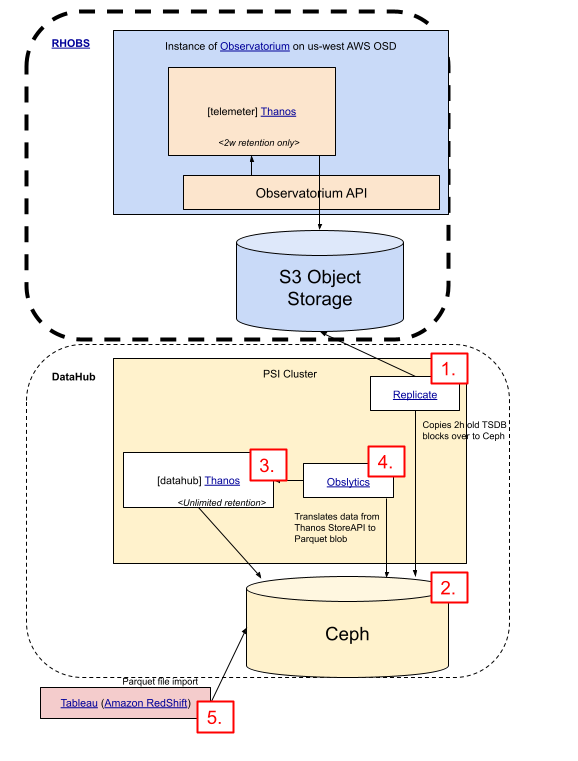

# Analytics based on Observability Data

We use the [`Apache Parquet`](https://parquet.apache.org/) format (e.g [Amazon RedShift](https://aws.amazon.com/redshift/)) to persist metrics data for RHOBS analytics.

Red Hat maintains community-driven project that is able to transform Prometheus data into Parquet files. See [Obslytics project to learn more](https://github.com/thanos-community/obslytics). It works by consuming (currently internal) RHOBS Store API.

If you wish to use this tool against RHOBS, contact us to discuss this feature request or add ticket to our `MON` JIRA project.

## Existing Production Pipelines

### Telemeter Analytics

DataHub and CCX teams are currently leveraging such analytics pipeline based on [Telemeter](use-cases/telemetry.md). The pipeline looks as follows:

*[Source](https://docs.google.com/drawings/d/19Z0vtVjlvU_p6aU3hn6PXdN0AWbd2FA4RAC0dT3hU_w/edit)*

1. DataHub runs [Thanos Replicate](https://thanos.io/tip/components/tools.md/#bucket-replicate) tool in their PSI cluster, which copies all fresh 2h size blocks from RHOBS, once they appear in RHOBS S3 object storage (~3h after ingestion).
2. Replicated blocks are copied to DataHub Ceph object storage and stored for unlimited time.
3. DataHub runs smaller Thanos system. For this part of the system, only the Thanos Store Gateway is needed to provide Store API for further Obslytics step.
4. Instance of [Obslytics](https://github.com/thanos-community/obslytics) transforms Thanos metrics format to [`Apache Parquet`](https://parquet.apache.org/) and saves it in Ceph Object Storage.
5. Parquet data is then imported in [Amazon RedShift](https://aws.amazon.com/redshift/), and is joined with other data sources.
