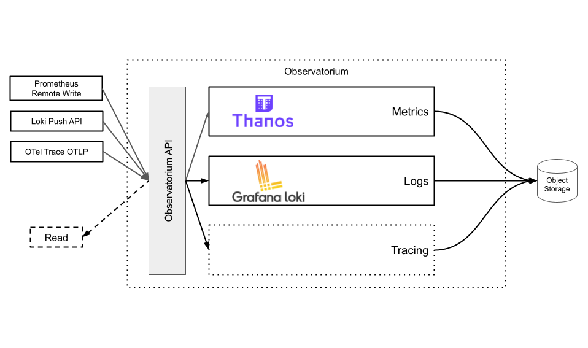
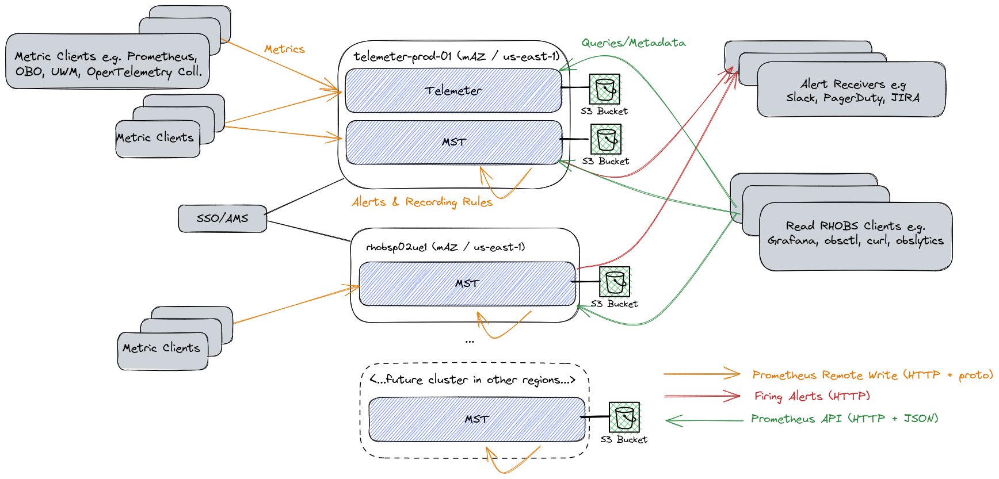
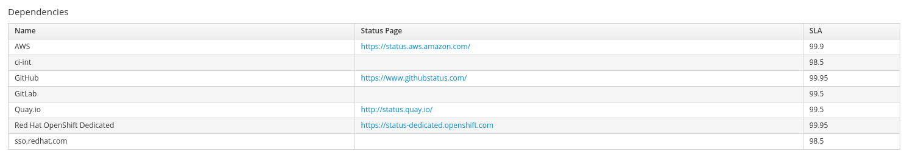
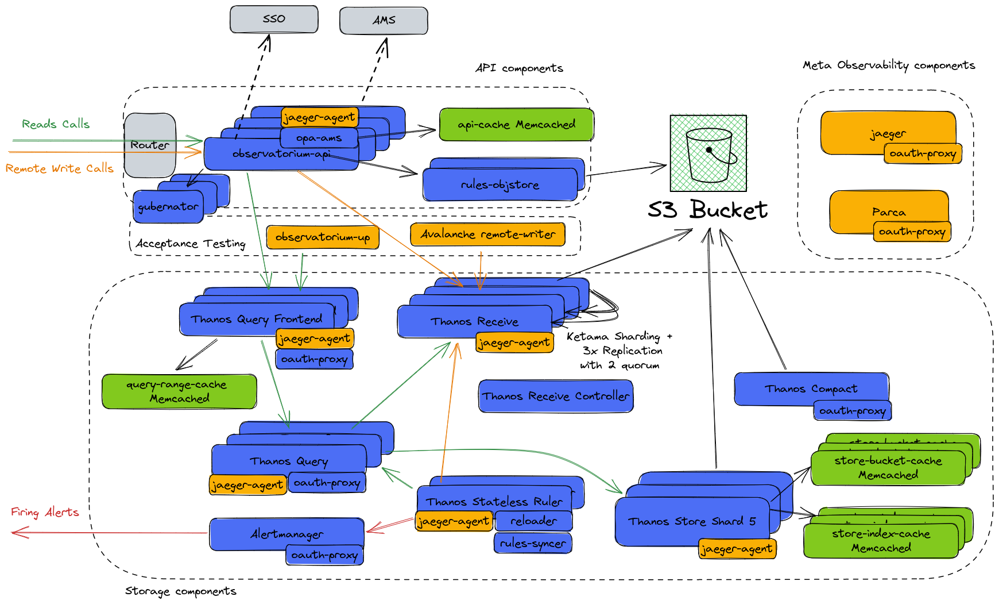

# Design

## Introduction

This document presents the general design of [the RHOBS service](./README.md). Generally, the RHOBS is a managed service running http://observatorium.io/[Observatorium] project for the Red Hat needs. The high-level overview of the single cluster Observatorium can be seen below:

Observatorium is a set of Jsonnet configuration pieces that deploy popular open-source observability backends for each signal (metric, logs and tracing) as needed. It also provides a separate API service that handles Saas-specific duties like tenancy, rate-limiting, authorization and authentication, etc.

It supports [Prometheus](https://prometheus.io/) (metric) APIs thanks to [Thanos](https://thanos.io/) open source project. Logging is provided with [Loki](https://github.com/grafana/loki) APIs and backend. Tracing with (not implemented yet) with [OpenTelemetry OTLP](https://github.com/open-telemetry/opentelemetry-specification/blob/main/specification/protocol/otlp.md) API for writes, [Jaeger](https://www.jaegertracing.io/) API for reads and [Tempo](https://github.com/grafana/tempo) as a backend.

Those sub-projects were chosen because of their similar architecture, scalability patterns and open source practices. The key fact is that they all use object storage as the primary data store, which allows cheap long-term retention of the (mostly) immutable observability data.

The RHOBS service uses Observatorium. We deploy Observatorium on multiple clusters in multiple regions. It also adds integration services and connections to Red Hat-specific dependencies. The rest of the document describes all the pieces in detail.

> NOTE: This document will focus on the metric signal. Logging is only partially deployed in certain places but is not yet a critical dependency on anything. It is also deployed in logical and network separation to the metric backend, so it should not affect the metric system; thus, all signals can be described separately. Tracing is in heavy progress as well.

## Metrics

### Architecture

The current high-level architecture of the production service looks as follows:

Legend:

* Blue background: Managed by RHOBS.
* Grey background: Third-party managed software.
* Orange arrows: Metric ingestion.
* Red arrows: Firing alert notifications.
* Green arrow: Metric / Rules / Alerts Read API traffic.
* Black lines: Backbone communication (e.g. with object storage or authZ/authN with SSO).

The RHOBs design is based on multiple shards that represent isolated [RHOBS-specific Observatorium](https://github.com/rhobs/configuration) installations. Shards are currently deployed to two clusters, but the design is prepared to have more clusters in different regions to lower the damage radius for regional incidents.

All clusters are [the OSD](https://docs.openshift.com/dedicated/welcome/index.html), multi-availability zone clusters scheduled using AppSRE's AppInterface declarative GitOps API. See (behind VPN):

* [telemeter-prod-01](https://gitlab.cee.redhat.com/service/app-interface/-/blob/master/data/openshift/telemeter-prod-01/cluster.yml)
* [rhobsp02ue1](https://gitlab.cee.redhat.com/service/app-interface/-/blob/master/data/openshift/rhobsp02ue1/cluster.yml)

Each Observatorium installation represents RHOBS "shard" and uses multiple Kubernetes namespaces. Typically single shard is limited by the single cluster capacity (amount of the nodes it can handle--usually around 200 for OSD), so we keep a single shard in a single cluster. The only exception is `Telemeter` deployment, which for historical reasons is a separate hard tenant (see [Tenancy](#Tenancy)) deployed next to `MST` in one cluster. `Telemeter` tenant is used for [OpenShift remote health monitoring](https://access.redhat.com/documentation/en-us/red_hat_openshift_container_storage/4.5/html/monitoring_openshift_container_storage/remote_health_monitoring).

> NOTE: Telemeter was the first responsibility of our service team in the past. We build RHOBS in a way that Telemeter can be a single-region hard tenant. It is isolated because it has different characteristics as typical observability data. It contains very cardinal data with only ~5m sample interval. There is no alerting, only analytic PromQL queries and integration with analytics tools like [obslytics](https://github.com/thanos-community/obslytics). We will focus on `MST` in this design as this is what will be used by the majority of the users.

The set of features, topology and interactions are the same across all RHOBS shards. In addition, each shard allows secure and multi-tenant:

* Metric ingestion in Prometheus data model.
* Metric storage, including long-term storage using object storage.
* Querying APIs using PromQL language.
* Other metric,rule and alert retrieval APIs [supported by Prometheus](https://prometheus.io/docs/prometheus/latest/querying/api/): [Full list](https://github.com/observatorium/api/blob/23af39e5f09845a12dec7179c47b0b364f0a35b0/api/metrics/v1/http.go#L27).
* Custom recording rule evaluation.
* Custom alerting rule evaluation and routing.

At the current moment, the design assumes no cross-communication across shards. No data replication or cross-shard queries. However, in future, there is a plan to [add a federation layer that will allow cross-shard querying](https://issues.redhat.com/browse/RHOBS-40) and a truly global view of observability data. Currently, the user can do that on their own using software like [Thanos Querier](https://thanos.io/tip/components/query.md/, [promxy](https://github.com/jacksontj/promxy) or by graphing multiple Queries with [Grafana](https://grafana.com/grafana/dashboards/).

The RHOBS have [the following dependencies](https://visual-app-interface.devshift.net/services#/services/rhobs/app.yml):

From the deployment point of view:

* AWS (EC2 and S3)
* OSD with AppSRE local monitoring.
* [Red Hat SSO](https://sso.redhat.com/auth/realms/redhat-external)
* [Account Manager Service (AMS)](https://visual-app-interface.devshift.net/services#/services/ocm/ams/app.yml)

> NOTE: We also have a set of staging and testing clusters, which are not covered in this document.

Now, look at a single shard RHOBS architecture at the microservice level.

### Services and Interaction Points

The ful

Legend:

* Blue boxes: Core functional microservices.
* Green boxes: Best effort caches.
* Yellow boxes: Testing and Meta Observability components.

> "Meta Observability" means observability tools that observe RHBOS services presented in the diagram. Good, independent self-monitoring and observability for the observability system are the key. For metrics, we use the local Prometheus setup offered by AppSRE, so it's not presented in the diagram.

#### API Components

The API components compose the interface of our service. Every external traffic goes through this multi-tenant layer. It is fully stateless and thus can scale horizontally with the load.

| Name                                                                                                                                                                  | Type        | Image                                | Purpose                                                                                                                                                                                                                                                                                                                                                                                                                                          | Sidecars                                                            |
|-----------------------------------------------------------------------------------------------------------------------------------------------------------------------|-------------|--------------------------------------|--------------------------------------------------------------------------------------------------------------------------------------------------------------------------------------------------------------------------------------------------------------------------------------------------------------------------------------------------------------------------------------------------------------------------------------------------|---------------------------------------------------------------------|
| [observatorium-api](https://github.com/rhobs/configuration/blob/1861e53c2932baf65b82b358a67033c9704915e0/resources/services/observatorium-template.yaml#L810)         | Deployment  | quay.io/observatorium/api            | Stateless proxy for authZ, authN, tenancy injection, rate limiting. Every external communication goes through it. The [opa-ams](https://github.com/rhobs/configuration/blob/1861e53c2932baf65b82b358a67033c9704915e0/resources/services/observatorium-template.yaml#L900) runs as a sidecar which transforms [AMS to OpenPolicyAgent](https://github.com/observatorium/opa-ams). AMS is used can be used for some tenants for the authorization. | [opa-ams]((https://github.com/observatorium/opa-ams)), jaeger-agent |
| [api-cache-memcached](https://github.com/rhobs/configuration/blob/1861e53c2932baf65b82b358a67033c9704915e0/resources/services/observatorium-template.yaml#L95)        | StatefulSet | quay.io/app-sre/memcached            | Distributed cache for...                                                                                                                                                                                                                                                                                                                                                                                                                         | metrics exporter                                                    |
| [rule-objstore](https://github.com/rhobs/configuration/blob/1861e53c2932baf65b82b358a67033c9704915e0/resources/services/observatorium-template.yaml#L161)             | Deployment  | quay.io/observatorium/rules-objstore | Translates [object storage API to Rules API](https://github.com/observatorium/rules-objstore)                                                                                                                                                                                                                                                                                                                                                    | -                                                                   |
| [observatorium-gubernator](https://github.com/rhobs/configuration/blob/1861e53c2932baf65b82b358a67033c9704915e0/resources/services/observatorium-template.yaml#L1097) | Deployment  | quay.io/app-sre/gubernator           | Distributed rate-limiter for API traffic handled by observatorium-api.                                                                                                                                                                                                                                                                                                                                                                           | -                                                                   |

#### Storage Components

Storage components are responsible for reading, ingesting and processing metric-related data in a multi-tenant and efficient way. Specifically, the data are:

* Metric Series (samples associated with labels)
* Recording rules.
* Alerting rules.
* Exemplars (ingestion disabled for now).
* Metadata (ingestion disabled for now).

The majority of components in come [the Thanos project](https://thanos.io/) which is at the core of the metric RHOBS system and shared some code with Prometheus. We also run native [Alertmanager](https://prometheus.io/docs/alerting/latest/alertmanager/)) from the Prometheus project. The team also actively contributes to and maintains Thanos & Prometheus.

| Name                                                                                                                                                                           | Type        | Image                                           | Purpose                                                                                                                                                                                                                                                                                                                                                                                                                                                                                                                                                   | Sidecars                                                                                                                                 |
|--------------------------------------------------------------------------------------------------------------------------------------------------------------------------------|-------------|-------------------------------------------------|-----------------------------------------------------------------------------------------------------------------------------------------------------------------------------------------------------------------------------------------------------------------------------------------------------------------------------------------------------------------------------------------------------------------------------------------------------------------------------------------------------------------------------------------------------------|------------------------------------------------------------------------------------------------------------------------------------------|
| [thanos-compact](https://github.com/rhobs/configuration/blob/1861e53c2932baf65b82b358a67033c9704915e0/resources/services/observatorium-metrics-template.yaml#L82)              | StatefulSet | quay.io/thanos/thanos                           | [Compactor](https://thanos.io/tip/components/compact.md/) is responsible for compacting 2h blocks into bigger time ranges which compresses indexes. It performs deletions, retention appliance and downsampling. It also offers admin Block UI for debugging purposes.                                                                                                                                                                                                                                                                                    | [oauth-proxy](https://quay.io/openshift/origin-oauth-proxy)                                                                              |
| [alertmanager](https://github.com/rhobs/configuration/blob/1861e53c2932baf65b82b358a67033c9704915e0/resources/services/observatorium-metrics-template.yaml#L311)               | StatefulSet | quay.io/prometheus/alertmanager                 | [Alertmanager](https://prometheus.io/docs/alerting/latest/alertmanager/) routes grouped firing alerts to configured receivers like Slack, PagerDuty etc.                                                                                                                                                                                                                                                                                                                                                                                                  | [oauth-proxy](https://quay.io/openshift/origin-oauth-proxy)                                                                              |
| [thanos-stateless-ruler](https://github.com/rhobs/configuration/blob/1861e53c2932baf65b82b358a67033c9704915e0/resources/services/observatorium-metrics-template.yaml#L777)     | StatefulSet | quay.io/thanos/thanos                           | Evaluate recording rules and alerting rules. Recorded data is pushed to Thanos Receive. Rules configuration comes from rule-syncer sidecar which polls object storage.                                                                                                                                                                                                                                                                                                                                                                                    | [configmap-reloader](quay.io/openshift/origin-configmap-reloader), jaeger-agent, [rule-syncer](quay.io/observatorium/thanos-rule-syncer) |
| [thanos-query](https://github.com/rhobs/configuration/blob/1861e53c2932baf65b82b358a67033c9704915e0/resources/services/observatorium-metrics-template.yaml#L991)               | Deployment  | quay.io/thanos/thanos                           | [Query](https://thanos.io/tip/components/query.md/) is responsible for API fanout and federated semantic merges across multiple shards and replicas of data like: series, metadata, labels, exemplars, rules and alert views. It also perform query pushdown and parallelization if needed.                                                                                                                                                                                                                                                               | [oauth-proxy](https://quay.io/openshift/origin-oauth-proxy), jaeger-agent                                                                |
| [query-range-cache](https://github.com/rhobs/configuration/blob/1861e53c2932baf65b82b358a67033c9704915e0/resources/services/observatorium-metrics-template.yaml#L1241)         | StatefulSet | quay.io/app-sre/memcached                       | Distributed cache for query responses.                                                                                                                                                                                                                                                                                                                                                                                                                                                                                                                    | -                                                                                                                                        |
| [thanos-query-frontend](https://github.com/rhobs/configuration/blob/1861e53c2932baf65b82b358a67033c9704915e0/resources/services/observatorium-metrics-template.yaml#L1307)     | Deployment  | quay.io/thanos/thanos                           | Service that splits Prometheus Query API into multiple 1d queries for concurrency. It also caches the response and adjust time ranges for cachability. It also retry. Additonally it logs slow queries.                                                                                                                                                                                                                                                                                                                                                   | jaeger-agent,  [oauth-proxy](https://quay.io/openshift/origin-oauth-proxy)                                                               |
| [thanos-receive-controller](https://github.com/rhobs/configuration/blob/1861e53c2932baf65b82b358a67033c9704915e0/resources/services/observatorium-metrics-template.yaml#L1669) | Deployment  | quay.io/observatorium/thanos-receive-controller | Receiver controllers discover receive nodes through Kubernetes API and populate hashring configuration.                                                                                                                                                                                                                                                                                                                                                                                                                                                   | -                                                                                                                                        |
| [thanos-receive](https://github.com/rhobs/configuration/blob/1861e53c2932baf65b82b358a67033c9704915e0/resources/services/observatorium-metrics-template.yaml#L1859)            | StatefulSet | quay.io/thanos/thanos                           | [Receive](https://thanos.io/tip/components/receive.md/) is a stateful write-ahead-log that routes, replicates and writes series samples (and metadata and exemplars) based on hashring. Has a pod [distruption budget](https://github.com/rhobs/configuration/blob/1861e53c2932baf65b82b358a67033c9704915e0/resources/services/observatorium-metrics-template.yaml#L1816) and [podAffinity](https://github.com/rhobs/configuration/blob/1861e53c2932baf65b82b358a67033c9704915e0/resources/services/observatorium-metrics-template.yaml#L1891) specified. | jaeger-agent                                                                                                                             |
| [store-bucket-cache](https://github.com/rhobs/configuration/blob/1861e53c2932baf65b82b358a67033c9704915e0/resources/services/observatorium-metrics-template.yaml#L2456)        | StatefulSet | quay.io/app-sre/memcached                       | Distributed cache for Object Storage Metadata.                                                                                                                                                                                                                                                                                                                                                                                                                                                                                                            | -                                                                                                                                        |
| [store-index-cache](https://github.com/rhobs/configuration/blob/1861e53c2932baf65b82b358a67033c9704915e0/resources/services/observatorium-metrics-template.yaml#L2575)         | StatefulSet | quay.io/app-sre/memcached                       | Distributed cache for series postings used by Store Gateway to lookup metrics.                                                                                                                                                                                                                                                                                                                                                                                                                                                                            | -                                                                                                                                        |
| [thanos-store-shard-N](https://github.com/rhobs/configuration/blob/1861e53c2932baf65b82b358a67033c9704915e0/resources/services/observatorium-metrics-template.yaml#L2677)      | StatefulSet | quay.io/thanos/thanos                           | [Store](https://thanos.io/tip/components/store.md/) is responsible for querying series from TSDB blocks in Object Storage. It sharded using [block ID](https://github.com/rhobs/configuration/blob/main/resources/services/observatorium-metrics-template.yaml#L2779) hashmod.                                                                                                                                                                                                                                                                            | jaeger-agent                                                                                                                             |

#### Acceptance Testing

Components that perform continuous testing for functional and efficiency verification for SLI and rollout acceptance.

| Name                                                                                                                                                                  | Type        | Image                                | Purpose                                                                                                                                                                                                                                                                                                                                                                                                                                          | Sidecars                                                            |
|-----------------------------------------------------------------------------------------------------------------------------------------------------------------------|-------------|--------------------------------------|--------------------------------------------------------------------------------------------------------------------------------------------------------------------------------------------------------------------------------------------------------------------------------------------------------------------------------------------------------------------------------------------------------------------------------------------------|---------------------------------------------------------------------|
| [avalanche-remote-writer](https://github.com/rhobs/configuration/blob/1861e53c2932baf65b82b358a67033c9704915e0/resources/services/observatorium-template.yaml#L13)    | Deployment  | quay.io/observatorium/avalanche      | Testing load generator for test metrics into our test `rhobs` tenant, used for SLI measurements.                                                                                                                                                                                                                                                                                                                                                 | -                                                                   |
| [observatorium-up](https://github.com/rhobs/configuration/blob/1861e53c2932baf65b82b358a67033c9704915e0/resources/services/observatorium-template.yaml#L316)          | Deployment  | quay.io/observatorium/up             | Close box solution of periodic querying of test `rhobs` tenant for SLI monitoring using [following queries](https://github.com/rhobs/configuration/blob/1861e53c2932baf65b82b358a67033c9704915e0/resources/services/observatorium-template.yaml#L297).                                                                                                                                                                                           | -                                                                   |

#### Meta Observability

Components allowing distributed tracing and profiling of RHOBS components.

| Name                                                                                                                                       | Type       | Image                            | Purpose                                                                                                                                                                                                                                                                                                                                                                    | Sidecars                                                    |
|--------------------------------------------------------------------------------------------------------------------------------------------|------------|----------------------------------|----------------------------------------------------------------------------------------------------------------------------------------------------------------------------------------------------------------------------------------------------------------------------------------------------------------------------------------------------------------------------|-------------------------------------------------------------|
| [jaeger](https://github.com/rhobs/configuration/blob/1861e53c2932baf65b82b358a67033c9704915e0/resources/services/jaeger-template.yaml#L35) | Deployment | quay.io/jaegertracing/all-in-one | [Distributed Tracing Backend](https://www.jaegertracing.io/) for Meta-Observability with oauth-proxy for SSO. In-memory storage for short retention of traces. Waits for traces from jaeger agent sidecars and allows querying through Jaeger UI.                                                                                                                          | [oauth-proxy](https://quay.io/openshift/origin-oauth-proxy) |
| [parca](https://github.com/rhobs/configuration/blob/1861e53c2932baf65b82b358a67033c9704915e0/resources/services/parca-template.yaml#L124)  | Deployment | quay.io/observatorium/parca      | [Continuous profiling backend](https://github.com/parca-dev/parca) for Meta-Observability with oauth-proxy for SSO. It [polls Kubernetes discovery](https://github.com/rhobs/configuration/blob/main/resources/services/parca-template.yaml#L18) to get Go containers to scrape for common profiles like heap, CPU, gorutines etc. It allows querying profiles through UI. | [oauth-proxy](https://quay.io/openshift/origin-oauth-proxy) |

### Sequences and User Stories

* Ingesting Tenant Metrics: TBD
* Querying Tenant Metrics: TBD
* Compacting, Downsampling, Applying Retention for Storage: TBD
* Evaluating Tenant Recording and Alerting Rules: TBD
* Configuring Tenant Alerts and Recording Rules
* Fetching Loaded Tenant Alerts/Rules: TBD

#### Common Fail-over and Scaling Stories

* DDOS: TBD
* Tenant Misconfiguration/Misbehave: TBD
* Scaling Writes: TBD
* Scaling Reads: TBD
* Restarts of Thanos Receive Pods (Ingestion Pods)

#### Future 

On top the above, in future we plan to add following user stories:

* Automatic scale outs and scale downs based on traffic
* Deletions
* Backfilling Recording Rules
* Sharing series with other tenants
* Usage Monitoring

### Tenancy

The RHOBS tenant identifies the owner of data (metrics, rules, etc.). The owner can then manage and query such data (including alert and recording rule evaluations). In future tenant will be able to [allow accessing subset of their metrics to other tenants](https://issues.redhat.com/browse/RHOBS-107). Single tenant is recommended for group of people or services that should have isolated access and responsibility over certain metric data. 

The user management for who is part of tenant is out of the scope for RHOBS and should be handled outside of RHOBS, ideally with SSO team help. On the other hand, the RHOBS team manages RBAC that map certain service account `sub` ID token field to roles against certain tenant with read/write and metric/log/tracing granularity.

The RHOBS tenancy is label based. It means that within Thanos we build features that allows limit, monitor, ingest, read series and isolate for specific labels. In our case it's the `tenant_id = <TENANT>`. The correct `tenant_id` is found on `observatorium-api` level:

1. Tenant name is encoded either in the header of URL of the tenant Route.
2. Based on tenant we choose the authentication option. In most cases it's OIDC flow targeting Red Hat SSO as the issuer.
3. In OIDC case we expect ID Token. If it's missing or verification fails we are redirecting to SSO login flow.
4. If verification is successful we check RBAC or OPA-AMS for correct role to see if relevant action should be allowed.

### SLA

* Write: 99.5%
* Read: Unspecified yet.

### Risks

There is always something to improve (:

Some low level risk we are aware at the moment: 

1. We are migrating to new Thanos Receive configuration that addresses the limitation in sharding dynamic. Our load test shown positive results. This change should allow us to be very dynamic of Receive replicas and allow us to have more of them, but in smaller size. It will also allow us to quickly adapt to larger ingestion traffic. It's a risk, because it's a new change.
2. We are adding new tenant limit feature which adds a new logic for ensuring QoS when one tenant misbehaves.
3. We did not perform yet the exhausting read path load tests yet, but we already know we have to invest some time in efficiency optimizations around concurrent queries and limiting.
4. We were experiencing elevated incidents with the SSO in the past. If the SSO is down the service is fully down and there is no fallback path.
5. The OSD Routers can't handle elevated traffic, especially during DDOS or tenant misbehaves. We are researching using [ELB](https://aws.amazon.com/elasticloadbalancing/) together with AppSRE instead. 
6. Eventually we will hit single Compactor limit. This means we might not be able to compact fast enough or we won't be able to compress blocks further because of their size. Eventually we will need to reconfigure Compactor to per tenant sharding (low risk). In theory single tenant block can grow in size that we will hit block size limit. In such case Compactor will ignore such blocks and continue compacting smaller ones. This can be solved with [Vertical Sharding Design](https://github.com/thanos-io/thanos/issues/5437) (high risk). Compactor scaling can be further automated with proposals like [this](https://github.com/thanos-io/thanos/pull/5109/files) and [planner](https://github.com/thanos-io/thanos/pull/4458) when needed. 

