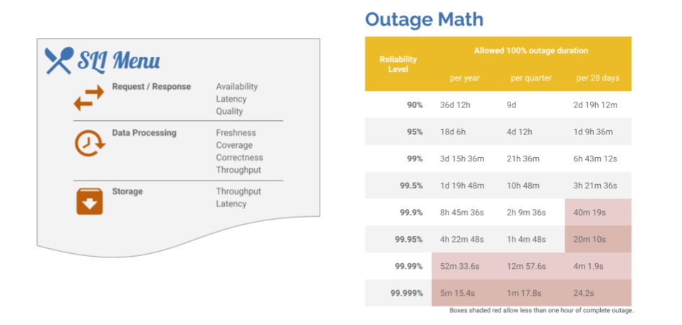

# MST

> For RHOBS Overview see [this document](README.md)

TBD(https://github.com/rhobs/handbook/issues/23)

## Support

TBD(https://github.com/rhobs/handbook/issues/23)

### Escalations

TBD(https://github.com/rhobs/handbook/issues/23)

## Service Level Agreement

If you manage [“Observatorium”](../../../Projects/Observability/observatorium.md), the Service Level Objectives can go ultra-high in all dimensions, such as availability and data loss. The freshness aspect for reading APIs is trickier as it also depends on client collection pipeline availability, among other things, which is out of the scope of the Observatorium.

RHOBS has currently established the following default Service Level Objectives. This is based on the infrastructure dependencies we have listed [here (internal)](https://visual-app-interface.devshift.net/services#/services/rhobs/app.yml).

> NOTE: We envision future improvements to the quality of service by offering additional SLO tiers for different tenants. Currently, all tenants have the same SLOs.

> Previous docs (internal):
> * [2019-10-30](https://docs.google.com/document/d/1LN-3yDtXmiDmGi5ZwllklJCg3jx-4ysNv6oUZudFj2g/edit#heading=h.20e6cn146nls)
> * [2021-02-10](https://docs.google.com/document/d/1iGRsFMR9YmWG8Mk95UXU_PAUKvk1_zyNUkevbk7ZnFw/edit#heading=h.bupciudrwmna)

TBD(https://github.com/rhobs/handbook/issues/23)
