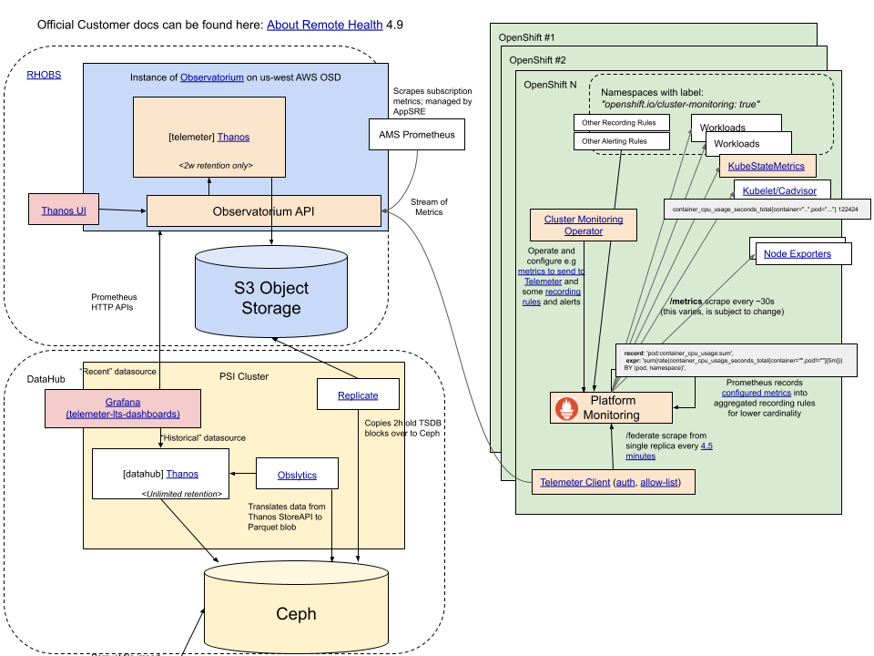

# Telemetry ("Telemeter")

> For RHOBS Overview see [this document](README.md)

Telemeter is the metrics-only hard tenant of the RHOBS service designed as a centralized OpenShift Telemetry pipeline for OpenShift Container Platform. It is an essential part of gathering real-time telemetry for remote health monitoring, automation and billing purposes.

*Official OpenShift Documentation*: https://docs.openshift.com/container-platform/4.7/support/remote_health_monitoring/about-remote-health-monitoring.html#telemetry-about-telemetry_about-remote-health-monitoring

## Product Managers

* Shannon Wilber

## Big Picture Overview

*[Source](https://docs.google.com/drawings/d/1eIAxCUS2v8Bt0-Ken2gHnx-Q1u8JNPfi2rMB-Azz5zI/edit)*

## Support

To escalate issues use, depending on issue type:

* For questions related to the service or kind of data it ingests, use `telemetry-sme@redhat.com` (internal) mail address. For quick questions you can try to use [#forum-telemetry](https://coreos.slack.com/archives/CEG5ZJQ1G) on CoreOS Slack.
* For functional bugs or feature requests use Bugzilla, with Product: `Openshift Container Platform` and `Telemeter` component ([example bug](https://bugzilla.redhat.com/show_bug.cgi?id=1914956)). You can additionally notify us about a new bug on `#forum-telemetry` on CoreOS Slack.
* For functional bugs or feature requests for historical storage (Data Hub), use the PNT Jira project.

> For the managing team: See our internal [agreement document](https://docs.google.com/document/d/1iAhzVxm2ovqkWxJCLplwR7Z-1gzXhfRKcHqXnpQh9Hg/edit#).

### Escalations

For urgent escalation use:

* For Telemeter Service Unavailability: `@app-sre-ic` and `@observatorium-oncall` on CoreOS Slack.
* For Historical Data (DataHub) Service Unavailability: `@data-hub-ic` on CoreOS Slack.

## Service Level Agreement

RHOBS has currently established the following default Service Level Objectives. This is based on the infrastructure dependencies we have listed [here (internal)](https://visual-app-interface.devshift.net/services#/services/rhobs/app.yml).

> Previous docs (internal):
> * [2019-10-30](https://docs.google.com/document/d/1LN-3yDtXmiDmGi5ZwllklJCg3jx-4ysNv6oUZudFj2g/edit#heading=h.20e6cn146nls)
> * [2021-02-10](https://docs.google.com/document/d/1iGRsFMR9YmWG8Mk95UXU_PAUKvk1_zyNUkevbk7ZnFw/edit#heading=h.bupciudrwmna)

#### Metrics SLIs

| API      | SLI Type     | SLI Spec                               | Period | SLI Implementation             | Dashboard                                                                                           |
|----------|--------------|----------------------------------------|--------|--------------------------------|-----------------------------------------------------------------------------------------------------|
| `/write` | Availability | The % of successful (non 5xx) requests | 28d    | Metrics from Observatorium API | [Dashboard](https://grafana.app-sre.devshift.net/d/Tg-mH0rizaSJDKSADJ/telemeter?orgId=1&refresh=1m) |
| `/write` | Latency      | The % of requests under X latency      | 28d    | Metrics from Observatorium API | [Dashboard](https://grafana.app-sre.devshift.net/d/Tg-mH0rizaSJDKSADJ/telemeter?orgId=1&refresh=1m) |

Read Metrics TBD.

*Agreements*:

> NOTE: No entry for your case (e.g. dev/staging) means zero formal guarantees.

| SLI                   | Date of Agreement | Tier               | SLO                                                                             | Notes                                                                                                                                                                                                           |
|-----------------------|-------------------|--------------------|---------------------------------------------------------------------------------|-----------------------------------------------------------------------------------------------------------------------------------------------------------------------------------------------------------------|
| `/write` Availability | 2020/2019         | Internal (default) | 99% success rate for incoming [requests](#write-limits)                         | This depends on SSO RedHat com SLO (98.5%). In worst case (everyone needs to refresh token) we have below 98.5%, in the avg case with caching being 5m (we cannot change it) ~99% (assuming we can preserve 5m) |
| `/write` Latency      | 2020/2019         | Internal (default) | 95% of [requests](#write-limits) < 250ms, 99% of [requests](#write-limits) < 1s |                                                                                                                                                                                                                 |

##### Write Limits

Within our SLO, the write request must match following criteria to be considered valid:

* Valid remote write requests using official remote write protocol (See conformance test)
* Valid credentials: (explanation TBD(https://github.com/rhobs/handbook/issues/24))
* Max samples: TBD(https://github.com/rhobs/handbook/issues/24)
* Max series: TBD(https://github.com/rhobs/handbook/issues/24)
* Rate limit: TBD(https://github.com/rhobs/handbook/issues/24)

TODO: Provide example tune-ed client Prometheus configurations for remote write
