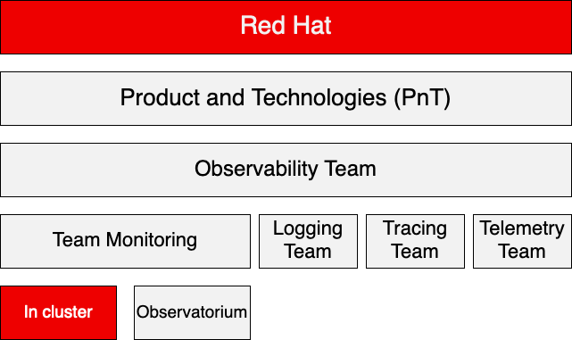

 

# Monitoring Team

## (In Cluster) Onboarding

---

# Where do we fit?

---

# Monitoring Team

## Composed by 2 teams that collaborate in certain projects

#### In-Cluster Team
- Responsible for the Cluster Monitoring Operator (CMO) which is a core operator of OpenShift in charge all things monitoring
- Responsible for the monitoring + alerting side of the Observability Operator (OO) which is an operator whose primary responsibility is to collect, process and forward observability signals but isn't in the business of providing a highly-scalable observability store.

---

## Composed by 2 teams that collaborate in certain projects

#### Observatorium Team (aka RHOBS Team)
- Responsible for the Observatorium project allows you to run and operate effectively a multi-tenant, easy-to-operate, scalable open-source observability system on Kubernetes.
- Responsible for providing Observability as a Service (aka RHOBS). The goal is to create a service that in-house teams can use and instead of them maintaining an observability stack on their side, they simply forward data to said service.

---

---

# Team Dynamics

## What work meeting do we have? How do we bond?

#### Work meetings

- 2 weekly team sync meetings to report and unblock progress, they are however not mandatory but you should report news from time to time.
- 1 sprint retrospective meeting to report what was accomplished during the sprint and show your plan for the next sprint
- 1 sprint review meeting with the observability group to review the team's biggest achievements and showcase demos
- Weekly 1-on-1 with manager and with team lead and/or mentor

---

## What work meeting do we have? How do we bond?

#### Team bonding meetings

- Show and/or Tell: (usually a sprintely) forum where a member of the team monitoring shares a blog post, article, video, or anything… they found insightful
- Happy Hour: a weekly meeting on Tuesday where we save 1 hour of our day to simply chat about anything with our in-cluster team members.
- Monitoring Team Virtual Pub Happy Hour: a weekly meeting on Friday afternoon where we share a beer and get ready for the weekend.

---

## How do we interact with users? How to ask for help?

#### User interaction

- Users ask questions on #forum-monitoring. We follow a rotating schedule where two members of the team are responsible for replying to users a day per week
- Weekly rotation on bug triage is known as bug boss duty where a member of the team will be responsible for triaging the bugs for the week
- It's always ok to ask the help of senior members when you don't know the answer 😉

---

## How do we interact with users? How to ask for help?

#### Asking for help

- #team-monitoring is the defacto for asking for help, if you @team-monitoring all members of the in-cluster team will be notified
- #observability-team is the channel when you want to involve members from outside the team but in the observability space
- #forum-monitoring is where users usually ask for help but we can use it as well (and the answer might even be quicker).
- Directly reach out to a member of the team (but don't expect an immediate response)

---

# Team Context

## 4.12 release to consolidate features and support HyperShift through Observability Operator

- We are a no-feature freeze team, this means we only stop coding features by code freeze and not by feature freeze, see [OpenShift calendar for dates](https://docs.google.com/spreadsheets/d/19bRYespPb-AvclkwkoizmJ6NZ54p9iFRn6DGD8Ugv2c/edit?usp=sharing).
- Throughout 4.11 the team saw 3 engineers leaving and 2 engineers joining.
- In 4.11 a lot of features were introduced so in 4.12 the plan of the team is to not overcommit and consolidate most of the features introduced.
- HyperShift is a middleware for hosting OpenShift control planes at a scale that solves cost and time to provision.
- Our team is responsible for supporting the Observability Operator (OO) the goal is to eventually be deployed in the data plane nodes of HyperShift clusters and forward data to Observatorium.

---

# Useful pointers

## Do we have an Onboarding guide? So many acronyms! Where can I schedule holidays?

- Your first task is following [our onboarding guide](https://rhobs-handbook.netlify.app/teams/onboading/)! If you feel are able to find a problem with it please be a champion and open a [PR to fix it](https://github.com/rhobs/handbook)!
- [Welcome to RedHat page](https://source.redhat.com/career/for-new-hires), it has lots of good points for newcomers
- RedHat engineers have an infamous reputation for using too many acronyms, fortunately, we have a dedicated [page that will help you](https://source.redhat.com/groups/public/red-hat-dictionary-or-lexicon).

---

- [Rover](https://rover.redhat.com) is the organization directory, useful for finding almost anything, you can check your profile by accessing the [profile page](https://rover.redhat.com/people/profile).
- [The Source](https://source.redhat.com/) is the go-to place to get information about almost everything.
- If you want to schedule personal time off (PTO) you should do it through [Workday](https://wd5.myworkday.com/redhat/d/home.htmld) and add an event to the Observability Group PTO google calendar. Team monitoring [Jira board](https://issues.redhat.com/secure/RapidBoard.jspa?projectKey=MON&rapidView=5512) where we host our issues
