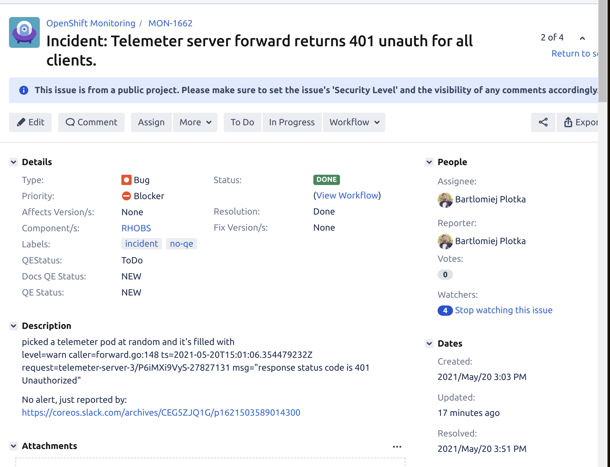

# Observability Platform Team SRE Processes

This document explains a few processes related to operating our production software together with AppSRE team. All operations can be summarised as the Site Reliability Engineering part of our work.

## Goals

The main goals of our SRE work within this team is to deploy and operate software that meets functional ([API](../../Projects/Observability/observatorium.md) and performance ([Telemeter SLO](../../Projects/Observability/RHOBS/telemeter.md#service-level-agreement), [MST SLO](../../Projects/Observability/RHOBS/mst.md#service-level-agreement)) requirements of our customers.

Currently, we offer internal service called [RHOBS](../../Projects/Observability/RHOBS) that is used across the company.

## Releasing Changes / Patches

In order to maintain our software on production reliably we need to be able to test, release and deploy our changes rapidly.

We can divide things we change into a few categories. Let's elaborate all processes per each category:

### Software Libraries

Library is a project that is not deployed directly, but rather it is a dependency for [micro-service application](#software-for-micro-services) we deploy. For example https://github.com/prometheus/client_golang or https://github.com/grpc-ecosystem/go-grpc-middleware

*Testing*:
* Linters, unit and integration tests on every PR.

*Releasing*
* GitHub release using git tag (RC first, then major/minor or patch release).

*Deploying*
* Bumping dependency in Service
* Following on Service [release and deploy steps](#software-for-micro-services).

### Software for (Micro) Services

Software for (micro) services usually lives in many separate open source repositories in GitHub e.g https://github.com/thanos-io/thanos, https://github.com/observatorium/api.

*Testing*:
* Linters, unit and integration tests on every PR.

*Releasing*
* GitHub release using git tag (RC first, then major/minor or patch release).
* Building docker images in quay.io and dockerhub (backup) using CI for each tag or main branch PR.

*Deploying*
* Bumping docker tag version in configuration.
* Following [configuration release and deployment steps](#configuration).

### Configuration

All or configuration is rooted in https://github.com/rhobs/configuration configuration templates written in jsonnet. It can be then overridden by defined parameters in app-interface saas files  .

*Testing*:
* [Building jsonnet resources](https://github.com/rhobs/configuration/blob/main/.github/workflows/ci.yml), linting jsonnet, validating openshift templates.
* Validation on App-interface side against Kubernetes YAMLs compatibility

*Releasing*
* Merge to main and get the commit hash you want to deploy.

*Deploying*
* Make sure you are on RH VPN.
* Propose PR to https://gitlab.cee.redhat.com/service/app-interface with the change of ref for the desired environment to desired commit sha is app-interface Saas file for desired tenant ([telemeter](https://gitlab.cee.redhat.com/service/app-interface/-/blob/master/data/services/rhobs/telemeter/cicd/saas.yaml#L70) or MST) or change environment parameter.
* Ask team for review. If change is impacting production heavily, notify AppSRE.
  * If only `saas.yaml` file was changed `/lgtm` from Observability Platform team is enough for PR to get merged automatically.
  * If any other file was changed, AppSRE engineer has to lgtm it.
* When merged, CI will deploy the changes to cluster specified in `saas.yaml` e.g to production.

NOTE: Don't change both production and staging in the same MR. NOTE: Deploy to production only changed that were previously in staging (automation for this TBD).

You can see the version change:
* [On monitoring dashboard](e.g https://prometheus.telemeter-prod-01.devshift.net/graph?g0.range_input=1h&g0.expr=thanos_build_info&g0.tab=0)
* See report of deploy on `#team-monitoring-info` Slack channel on CoreOS Slack.

### Monitoring Resources

Grafana Dashboards are defined here: https://github.com/rhobs/configuration/tree/main/observability/dashboards Alerts and Rules here: https://github.com/rhobs/configuration/blob/main/observability/prometheusrules.jsonnet

*Testing*:
* ):

*Releasing*
* Merge to main and get the commit hash you want to deploy.

*Deploying*
* Use `synchronize.sh` to create an MR/PR against app-interface. This will copy all generated YAML resources to proper places.
* Ask team for review. If change is impacting production heavily, notify AppSRE.
* When merged, CI will deploy the change to production. You can see the version change on Monitoring dashboard too e.g https://prometheus.telemeter-prod-01.devshift.net/graph?g0.range_input=1h&g0.expr=thanos_build_info&g0.tab=0.

## Incident Handling

This is the process we as the Observability Team try to follow during incident response.

The incident occurs when any of our services violates SLO we set with our stakeholders. Refer to [Telemeter SLO](../../Projects/Observability/RHOBS/telemeter.md#service-level-agreement) and [MST SLO](../../Projects/Observability/RHOBS/mst.md#service-level-agreement) for details on SLA.

NOTE: Following procedure applies to both Production and Staging. Many teams e.g SubWatch depends on working staging, so follow similar process as production. The only difference is that *we do not need to mitigate of fix staging issues outside of office hours*.

*Potential Trigger Points*:

* You got notified on Slack by AppSRE team or paged through Pager Duty.
* You got notified about potential SLA violation by the customer: Unexpected responses, things that worked before do not work now etc.
* You touch production for unrelated reasons and noticed something worrying (error logs, un-monitored resource etc).

1. If you are not on-call [notify Observability Platform on-call engineer](../../Projects/Observability/RHOBS/telemeter.md#escalations). If you are on-call, on-call engineer is not present or you agreed that you will handle this incident, go to step 2.
2. Straight away, create JIRA for potential incident. Don't think twice, it's easy to create and essential to track incident later on. Fill the following parts:

   * Title: Symptom you see.
   * Type: Bug
   * Priority: Try to assess how important it is. If impacting production it's a "Blocker"
   * Component: RHOBS
   * (Important) Label: `incident` `no-qe`
   * Description: Mention how you were notified (ideally with link to alert/Slack thread). Mention what you know so far.

      See example incident tickets [here](https://issues.redhat.com/issues/?jql=project%20%3D%20MON%20AND%20labels%20%3D%20incident)

3. If AppSRE is not yet aware, drop link to created incident ticket to #sd-app-sre channel and notify `@app-sre-primary` and `@observatorium-oncall`. Don't repeat yourself, ask everyone to follow the ticket comments.

   * AppSRE may or may not create dedicated channel, do communication efforts and start on-call Zoom meeting. We as the dev team don't need to worry about those elements, go to step 4.
4. Investigate possible mitigation. Ensure the problem is mitigated before focusing on root cause analysis.

   * Important: Note all performed actions and observations on created JIRA ticket via comments. This allows anyone to follow up what was checked and how. It is also essential for detailed Post Mortem / RCA process later on.
   * Note on JIRA ticket all automation or monitoring gaps you wished you had. This will be useful for actions after the incident.
5. Ensure if incident is mitigated with AppSRE. Investigate root cause. If mitigation is applied and root cause is known, claim the incident being over.
6. Note the potential long term fixes and ideas. Close the incident JIRA ticket.

### After Incident

1. After some time (within week), start a Post-mortem (RCA) document in Google Docs. Use following [Google Docs RCA template](https://docs.google.com/document/d/12ZVT35yApp7D-uT4p29cEhS9mpzin4Z-Ufh9eOiiaKU/edit). Put it in our RCA Team Google directory [here](https://drive.google.com/drive/folders/1z1j2ZwljT9jv-aYu7bkXzi03XMdBdFT9). Link it in JIRA ticket too.
2. Collaborate on Post Mortem. Make sure it is *blameless* but accurate. Share it as soon as possible with the team and AppSRE.
3. Once done, schedule meeting with the Observability Platform and optionally AppSRE to discuss RCA/Post Mortem action items and effect.

> Idea: If you have time, before sharing Post Mortem / RCA perform "Wheel of Misfortune". Select an on-call engineer who was not participaing in incident and simulate the error by triggering root-cause in safe environment. Then meet together with team and allow engineer to coordinate simulated incident. Help on the way to share knowledge and insights. This is the best way to on-board people to production topics.

> NOTE: Freely available SRE book is a good source of general patterns around in efficient incident management. Recommended read!
