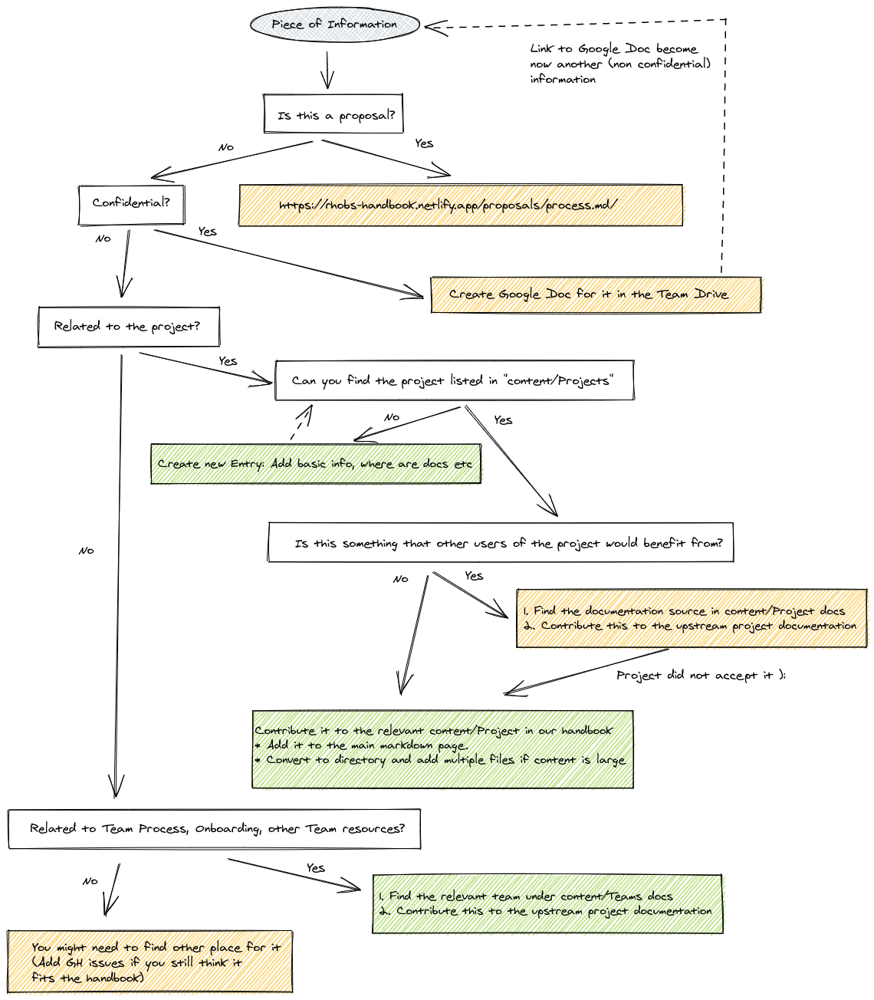
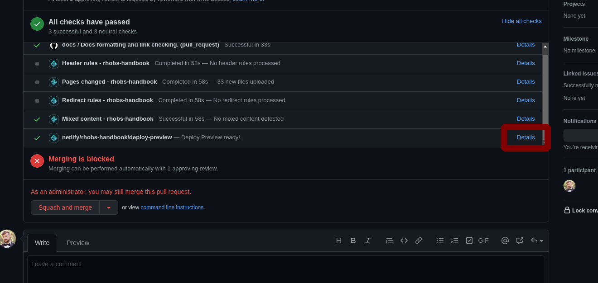

# Contributing

This document explains the process of modifying this handbook.

> You were instead looking at how to contribute to the projects we maintain and contribute as part of Monitoring Group? Check out the [Projects list!](Projects/README.md)

## Who can Contribute?

Anyone is welcome to read and contribute to our handbook! It's licensed with Apache 2. Any team member, another Red Hat team member, or even anyone outside Red Hat is welcome to help us refine processes, update documentation and FAQs.

If the handbook inspired you, let us know too!

## What and How You Can Contribute?

Follow [Modifying Documents Guide](#modifying-documents) and add GitHub Pull Request to https://github.com/rhobs/handbook:

* If you find a broken link, typo, unclear statements, gap in the documentation.
* If you find a broken element on `https://rhobs-handbook.netlify.app/` website or via [GitHub UI](https://github.com/rhobs/handbook/tree/main/content).
* If you want to add a new proposal (please also follow the proposal process (TBD)).
* If there is no active and existing PR for a similar work item. [TODO General Contribution Guidelines](https://github.com/rhobs/handbook/issues/7)

Add GitHub Issue to https://github.com/rhobs/handbook:

* If you don't want to spend time doing the actual work, you want to report it and potentially do it in your free time.
* If there is no current issue for a similar work item.

## Modifying Documents

This section will guide you through changing, adding or removing anything from handbook content.

> NOTE: It's ok to start with some large changes in Google Docs first for easier collaboration. Then, you can use [Google Chrome Plugin](https://workspace.google.com/marketplace/app/docs_to_markdown/700168918607) to convert it to markdown later on.

### Prerequisites

* Familiarise with [GitHub Flavored Markdown Spec](https://github.github.com/gfm/). Our source documentation is written in that markdown dialect.
* Check the goals for this handbook defined in the [Handbook proposal](Proposals/Accepted/202106-handbook.md) to ensure you understand the scope of the handbook materials.
* Make sure you have installed Go 1.15+ on your machine.

### How to decide where to put the content?

NOTE: Make sure to not duplicate too much information with the project documentation. Docs are aging quickly.

### Editing the content

As you can read from the [Handbook proposal](Proposals/Accepted/202106-handbook.md), our website framework ([`mdox`](https://github.com/bwplotka/mdox) and [Hugo](https://gohugo.io/) is designed to allow maintaining the source documentation files written in markdown in website agnostic way. Just write a markdown like you would write it if our main rendering point would be a [GitHub UI](https://github.com/rhobs/handbook/tree/main/content) itself!

#### Changing Documentation Files

1. Go to https://github.com/rhobs/handbook/ and fork it.

2. Git clone it on your machine, add a branch to your fork (alternatively, you can use GitHub UI to edit file).

3. Add, edit or remove any markdown file in [`./content`](https://github.com/rhobs/handbook/tree/main/content) directory. The structure of directories will map to the menu on the website.

4. Format markdown.

We mandate opinionated markdown formatting on our docs to ensure maintainability. As humans, we can make mistakes, and formatting will quickly fix inconsistent newlines, whitespaces etc. It will also validate if your relative links are pointing to something existing (!). Run `make docs` from repo root.

> NOTE: Use relative links directly to markdown files when pointing to another file in the `content` directory. Don't link to the same resources on the website. The framework will transform from link to md file into the link to relative URL path on the website.

> NOTE: The CI job will check the formatting and local links, so before committing, make sure to run `make docs` from the main repo root!

1. Create PR

2. Once the PR is merged, the content will appear on our website `https://rhobs-handbook.netlify.app/` and [GitHub UI](https://github.com/rhobs/handbook/tree/main/content).

#### Adding Static Content

All static content that you want to link to or embed (e.g. images) add to the `content` (ideally to [`content/assets`](https://github.com/rhobs/handbook/tree/main/content/assets) for clean grouping) and relatively link in your main document.

It's recommended to check if your page renders well before merging (see [section below](#early-previews)).

> NOTE: If you used some tool for creating diagrams (e.g checkout amazing https://excalidraw.com/), put the source file into assets too. If online tool was used, e.g Google Draw, add link to the markdown so we can edit those easily.

#### Early Previews

While editing documentation, you can run the website locally to check how it all looks!

*Locally:*

Run `make web-serve` from repo root. This will serve the website on `localhost:1313`.

> NOTE: Currently, some options reload in runtime e.g. CSS, but content changes require `make web-serve` restart. See https://github.com/bwplotka/mdox/issues/35 that tracks fix for this.

*From the PR:*

Click `details` on website preview CI check from netlify:

> Something does not work? Link works on GitHub but not on the website? Don't try to hack this up. It might bug with our framework. Please raise an issue on https://github.com/rhobs/handbook/ for us to investigate.

## Advanced: Under the hood

We do advanced conversions from source files in `content` dir to the website. Let's do a quick overview of our framework.

* [`./web`](https://github.com/rhobs/handbook/tree/main/web) contains resources related to the website.
* [`./web/themes`](https://github.com/rhobs/handbook/tree/main/web/themes) hosts our Hugo theme [`Docsy`](https://themes.gohugo.io/docsy/) as git submodule.
* [`./web/config.toml`](https://github.com/rhobs/handbook/blob/main/web/config.toml) holds Hugo and theme configuration.
* [`./netlify.yaml`](https://github.com/rhobs/handbook/blob/main/netlify.toml) holds our Netlify deployment configuration.)
* [`.mdox.yaml`](https://github.com/rhobs/handbook/blob/main/.mdox.yaml) holds https://github.com/bwplotka/mdox configuration that tells mdox how to *pre-process* our docs.

When you run `make web` or `make web-server`, a particular process is happening to "render" the website:

1. `mdox` using `.mdox.yaml` is transforming the resources from `content` directory, moving into website friendly form (adding frontmatter, adjusting links and many others) and outputs results in `./web/content` and `./web/static` which are never committed (temporary directories).
2. We run Hugo, which renders the markdown files from `./web/content` and using the rest of the resources in `./web` to render the website in `./web/publish`.
3. Netlify then knows that website has to be hosted from `./web/publish`.

## How to contact us?

Feel free to put an [issue or discussion topic on our handbook repo](https://github.com/rhobs/handbook), ask @bwplotka or @onprem users on Slack or catch us on Twitter.
